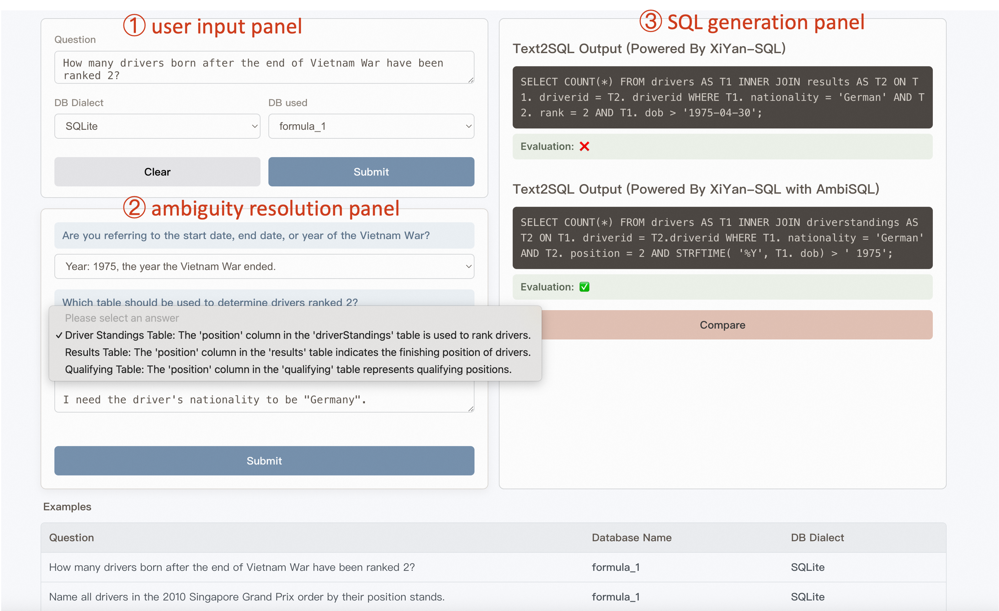

# AmbiSQL: Interactive Ambiguity Detection and Resolution for Text-to-SQL

[](https://opensource.org/licenses/Apache-2.0)
[](https://www.python.org/downloads/release/python-390/)

## Introduction
Text-to-SQL systems translate natural language questions into SQL queries, providing substantial value for non-expert users. While large language models (LLMs) show promising results for this task, they remain error-prone. Query ambiguity has been recognized as a major obstacle for LLM-based Text-to-SQL systems, leading to misinterpretation of user intent and inaccurate SQL generation. 

**AmbiSQL** is an interactive system that automatically detects query ambiguities and guides users through intuitive multiple-choice questions to clarify their intent. It is built on a fine-grained ambiguity taxonomy for identifying ambiguities that affect database element mapping and LLM reasoning, then incorporates user feedback to rewrite ambiguous questions.

## ✨ Key Features

*   **Automatic Ambiguity Detection:** Identifies and classifies ambiguous phrases in the user's query based on a systematic ambiguity taxonomy.
*   **Interactive Clarification:** Generates intuitive multiple-choice questions to let the user clarify their exact intent.
*   **Query Rewriting:** Incorporates user feedback to construct a new, unambiguous natural language query.
*   **Improved SQL Accuracy:** Provides a clean, precise query to a downstream Text-to-SQL system, boosting the accuracy of the generated SQL.

## 🌐 Live Demo

We have a live demo available for participants to explore: **[➡️ Try the AmbiSQL Demo](https://www.ambisql.tech)** 

## 🚀 Getting Started

Follow these steps to set up and run AmbiSQL on your local machine.

### Prerequisites

Make sure you have the following installed:
*   [Conda](https://docs.conda.io/en/latest/miniconda.html)
*   [Node.js](https://nodejs.org/) (including npm)
  
### Data Preparation
The database file used for evaluation is a subset of the [BIRD benchmark](https://bird-bench.github.io/), which can be downloaded from the [data repository](https://bird-bench.oss-cn-beijing.aliyuncs.com/minidev.zip). We expect the unzipped database file to be stored in the project root directory(eg. /MINIDEV/...).

### 1. Setup and Run the Backend (Server)

The backend is a Python server that handles all the logic for ambiguity detection and resolution.

```shell
# Navigate to the server directory
cd server

# Create and activate the conda environment
conda create -n ambiSQL python=3.9 -y
conda activate ambiSQL

# Install all dependencies
pip install -r requirements.txt

# run server on localhost.
python server.py
```

### 2. Setup and Run the Frontend (Chatbox)

The frontend is a web interface for interacting with AmbiSQL.

```shell
# Navigate to the chatbox directory
cd chatbox

# Install all dependencies
npm cache clean --force
npm install

# Start the development server for the frontend
npm run dev
```
Remember to fill in your own `OPENAI_API_KEY` and `MODELSCOPE_API_KEY` into the project.

## ⚙️ How It Works: An Example


<p align="center">
  
</p>


The user interface is split into three main panels: User Input, Ambiguity Resolution, and SQL Generation.

1.  **User Input Panel `①`:**
    A user enters an ambiguous query, such as *"How many drivers born after the Vietnam War have been ranked 2?"*. They can also select the database and SQL dialect. For quick exploration, users can also load predefined examples from our dataset.

2.  **Ambiguity Resolution Panel `②`:**
    AmbiSQL detects ambiguities and presents clarification questions:
    *   For **"the end of the Vietnam War,"** it asks the user to choose a specific date (e.g., end date, or just the year).
    *   For **"ranked 2,"** it presents a choice of relevant database columns (e.g., `rank`, `position`, `positionOrder`), showing a data snippet for context.
    The user selects their desired options from dropdown menus. They can also add optional constraints, like specifying the driver's nationality.

3.  **SQL Generation Panel `③`:**
    After clarification, AmbiSQL rewrites the query and sends it to the downstream Text-to-SQL model ([XiYan-SQL](https://xgenerationlab-xiyan-qwen-instruct.ms.show/?) in our example). This panel displays a side-by-side comparison:
    *   **Without AmbiSQL:** The SQL generated from the original, ambiguous query is often incorrect.
    *   **With AmbiSQL:** The SQL generated from the clarified query accurately reflects the user's intent.

The **`Compare`** button validates the generated SQL against the ground truth, demonstrating how ambiguity resolution leads to more accurate results.

## 📜 License

This project is licensed under the [Apache License 2.0](LICENSE).